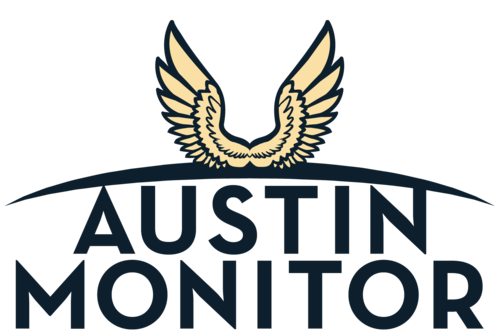
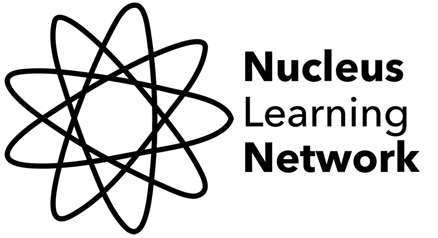

### Partnering Organizations:

- Mozilla Gigabit Community Fund
- Austin Monitor (Capital of Texas Media Foundation)
- Nucleus Learning Network
- Civic Party Software
- Open Austin

**Project Purpose:** To promote an awareness of internet health by fostering learners’ web literacy, this grant is supporting the development of three interactive web literacy lessons and web apps to facilitate learning.

**What are we working on?**

- Feb 24-26, 2017: Misinfo Con
  - [Saturday Discussion Notes](https://docs.google.com/document/d/1Jkpe0KwSjBbMhZxYXtPIratLiPFKbnGes1G8dzM2Mzo/edit?usp=sharing)
  - Sunday Wireframes for Legit-o-Meter
    - [Mockingbird Link](https://gomockingbird.com/projects/1ai9dty/EbZl46)
    - [Notes ](/unit1/Feb_26_wireframes.md)
  - [Sunday Presentation Slides](https://docs.google.com/a/mozilla.com/presentation/d/1-Ks6Cd87tmEQyJVqqCzxCBH8ZYmUV-NdVJLI5kD8zwo/edit?usp=sharing)
  - [List of other MisinfoCon presentations](https://hackpad.com/Presentations-list-HEfQO6oBc79)
- Feb 23, 2017: Drafts [notes](https://docs.google.com/a/nucleuslearningnetwork.org/document/d/1YczOCZ9QrWhbbqqNkX57JwtOrbS5xdSsa7rgeyi4W-c/edit?usp=sharing) for Lessons 2 & 3
- Feb 17, 2017: Draft product spec and curriculum for Lesson 1 (Legit-o-Meter) complete
  - [Lesson Plan & Worksheet](https://docs.google.com/document/d/1fiA4r5OKVco8b9Gjk7QW4ZlxalsWK4_IpfWV1PITzK4/edit?usp=sharing)
  - [Web App Product Brief](https://docs.google.com/document/d/1wjEQ1J8NYLxTLQ2HNXMtlJkVIZa60feeGEWoNS80ZLo/edit?usp=sharing)
- Feb 9, 2017: Fake the News team met for brainstorming on the three lesson. Sarah (Nucleus Learning Network) is tasked with creating a Curriculum Outline Draft and Mateo (Open Austin) is tasked with creating a Design Brief for the Legit-o-Meter web app.

_These are all working titles_

### Lesson #1: Legit-o-Meter

The goal of Lesson 1 is to give students the tools to examine a web article's credibility. The Fake the News team will develop a web app version of the [Kraken the Code Web Literacy Exercise](https://mozilla.github.io/webmaker-curriculum/WebLiteracyBasics-I/session01-kraken.html).

### Lesson #2: Rewriting History

The goal of Lesson 2 is to help students understand the origins and consequences of fake news using historical examples. By the end of the lesson, they will understand what motivates this ecosystem and how money, propoganda, misinformation, and political bias influence the content we see online.

### Lesson #3: Run the Presses

The goal of the Lesson 3 is to put students in the seat of the important roles at a news publishing organization. As a journalist, what goes into writing and article? As an Editor, what articles do you choose run with and why?
